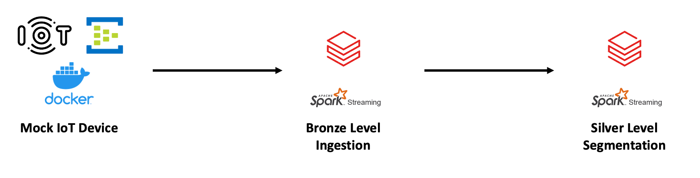

# Databricks IoT Spark Structured Streaming Project

## Overview
Mini-project using spark structured streaming and the Databricks medallion architecture against a simulated IoT device pushing data to Azure Storage Account. 

Aim was to use spark structured streaming to ingest and process IoT data in near-real-time, utilizing checkpoints and other spark API functionalities to achieve fault tolerance. 

Simulated an external on-premise IoT Device using Docker and Azure EventHub. 

## Business Problem 
> IoT device lands data every few seconds into Azure Storage in JSON format which needs to be ingested properly and then processed

## Scenario Flow
0. Created a Dockerized mock IoT device using Pandas and Azure BlobServiceClient
1. Pushed mock IoT data to Azure Storage Account
2. Ingested the data using spark structured streaming on Databricks (Bronze level)
3. Segmented the bronze level data and used structured streaming to create processed tables (Silve level)

## Technologies
- Languags: Python, Scala, DeltaSQL
- Frameworks: Spark/Pyspark
- Services: Databricks, Azure(Storage Account, EventHub), Docker

## Data Used
Simulated a mock IoT device and data. Creation script and containerization files can be found in `mock_iot_data/mock_data_gen.py` and the Dockerfile. 

## Architecture

## Requirements
- Requires an Azure account
- Code segments are either containerized, or can be staged outside Databricks simply by creating spark sessions within the appropriate scripts (which is not necessary in Databricks)

**E.O.D**
